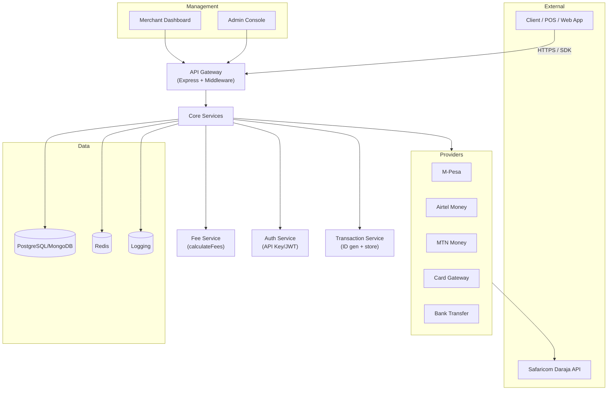

# M‑Pesa SDK for Kenyan SMEs

A lightweight, developer‑friendly Node.js/Express SDK that helps Kenyan small and medium enterprises (SMEs) accept mobile‑money payments via Safaricom’s Daraja API—featuring graduated, bracket‑based fees, tiered subscriptions, premium add‑ons, real‑time reconciliation, and easy integration with local systems.

---

[](https://www.npmjs.com/package/mpesa-sdk-kenya)  
[](LICENSE)

---

## 🚀 Features

- **Graduated Bracket‑Based Fees**  
  - Fees are calculated using Safaricom’s actual tariff brackets + our fixed‑plus‑percent markup.  
  - Transparent breakdown: Safaricom fee vs. our markup vs. total fee.

- **Tiered Subscription Cushion**  
  - Modest monthly subscription tiers to cover fixed costs and stabilize revenue.  
  - Starter merchants pay KSh 800/mo + transaction fees; higher‑volume tiers pay less or zero.

- **Daraja STK Push Integration**  
  - Securely initiate payment prompts to customer phones with built‑in `/checkout` endpoint.

- **Webhook Support**  
  - Real‑time `/webhook` endpoint for payment confirmations, fees recorded per transaction.

- **Premium Add‑Ons**  
  - Analytics dashboard, fraud alerts, automated reconciliation, inventory integration, multi‑currency support.

- **POS‑Ready & ERP‑Ready**  
  - Embed in Android POS via WebView or native HTTP calls.  
  - One‑click Odoo manifest endpoint for Open Source ERP integration.

---

## 📁 Project Structure

```
pan-african-payment-sdk/
│
├── core/                  # Core services (fees, auth, transactions, utils)
├── payment-methods/       # Integrations: M-Pesa, Airtel, MTN, Card, Bank
├── integrations/          # SDK packages: mobile, web, server (Node, PHP, Python)
├── premium-services/      # Analytics, fraud detection, inventory, multi-currency
├── management/            # Merchant dashboard & admin console
├── config/                # Deployment configuration schema & defaults
├── scripts/               # Cron jobs (e.g. monthly resets)
├── docs/                  # API reference & detailed architecture
├── test/                  # Unit & integration tests
├── .env.example
├── Dockerfile
├── docker-compose.yml
├── nginx/
│   └── nginx.conf
├── package.json
├── README.md
└── LICENSE
```

---

## 📐 Architecture Overview



---

## 💰 Pricing

### Fee Calculation by Transaction Bracket

| Transaction Range (KES) | Safaricom Fee | Our Markup                          | Total to Merchant           |
|-------------------------|--------------:|-------------------------------------|-----------------------------:|
| 1 – 100                 | 0             | Flat KSh 10                         | KSh 10                       |
| 101 – 500               | 7             | 1.5 % of amt (capped KSh 5)         | 7 + min(1.5%·amt, 5)          |
| 501 – 1 000             | 13            | 1.5 % of amt (capped KSh 10)        | 13 + min(1.5%·amt, 10)        |
| 1 001 – 2 500           | 33            | 1.25 % of amt (capped KSh 20)       | 33 + min(1.25%·amt, 20)       |
| 2 501 – 5 000           | 57            | 1.00 % of amt (capped KSh 30)       | 57 + min(1%·amt, 30)          |
| 5 001 – 15 000          | 100           | 0.75 % of amt (capped KSh 50)       | 100 + min(0.75%·amt, 50)      |
| 15 001 – 50 000         | 108           | 0.50 % of amt (capped KSh 75)       | 108 + min(0.5%·amt, 75)       |
| > 50 000                | 108           | 0.25 % of amt (capped KSh 100)      | 108 + min(0.25%·amt, 100)     |

> _See `utils/fees.js` for exact implementation._

### Subscription Tiers

| Tier         | Volume (KES) | Subscription (KES/mo) |
|--------------|-------------:|----------------------:|
| **Starter**    | 0 – 500 K    | 800                   |
| **Growing**    | 500 K – 1 M  | 600                   |
| **Business**   | 1 M – 5 M    | 400                   |
| **Enterprise** | > 5 M       | 0                     |

### Premium Add‑Ons

| Feature                      | Price (KES/mo) |
|------------------------------|---------------:|
| Analytics Dashboard          | 500            |
| Fraud Detection & Alerts     | 600            |
| Automated Reconciliation     | 800            |
| Inventory Integration        | 1 200          |
| Multi‑Currency Support       | 1 000          |

---

## 🔧 Installation

```bash
npm install mpesa-sdk-kenya
```

Or clone:

```bash
git clone https://github.com/yourusername/mpesa-sdk-kenya.git
cd mpesa-sdk-kenya
npm install
```

---

## ⚙️ Configuration

Copy and edit:

```bash
cp .env.example .env
```

```env
MPESA_BASE_URL=https://sandbox.safaricom.co.ke
MPESA_CONSUMER_KEY=your_key
MPESA_CONSUMER_SECRET=your_secret
MPESA_SHORTCODE=174379
MPESA_PASSKEY=your_passkey
APP_URL=https://yourdomain.com
CALLBACK_URL=https://yourdomain.com/webhook
FREE_TIER_LIMIT=100
FRAUD_ALERT_THRESHOLD=50000
MONTHLY_RESET_CRON="0 0 1 * *"

STARTER_SUB_FEE=800
GROWING_SUB_FEE=600
BUSINESS_SUB_FEE=400

ANALYTICS_PACKAGE_PRICE=500
FRAUD_ALERTS_PACKAGE_PRICE=600
RECONCILIATION_PACKAGE_PRICE=800
INVENTORY_INTEGRATION_PRICE=1200
MULTICURRENCY_PACKAGE_PRICE=1000

# DATABASE_URL=...
```

---

## ▶️ Quick Start

1. **Start server**  
   ```bash
   npm start
   ```

2. **Initiate payment**  
   ```js
   const res = await fetch('https://yourdomain.com/checkout', {
     method: 'POST',
     headers: { 'x-api-key': 'merchant_key', 'Content-Type': 'application/json' },
     body: JSON.stringify({ phone: '254712345678', amount: 1500 })
   });
   console.log(await res.json());
   ```

3. **Handle webhook**  
   M‑Pesa posts to `/webhook?merchantKey=<>&txnId=<>`, transactions & fees auto‑recorded.

4. **View dashboard**  
   ```bash
   GET /merchant/dashboard
   Headers: x-api-key: merchant_key
   ```

---

## 📖 API Reference

See [docs/api.md](docs/api.md) for full details.

---

## 🛠️ Development

- **Lint**: ESLint + Prettier  
- **Test**: Jest  
- **Cron**: `scripts/monthlyReset.js` via node-cron  
- **Webhook Debug**: ngrok

---

## 🔒 Production Hardening

1. Persist merchants & txns in PostgreSQL/MongoDB  
2. Secure auth with JWT/OAuth2  
3. Validate inputs (Joi/Zod)  
4. Verify Daraja webhook signatures  
5. Structured logging (Winston/Pino)  
6. Enforce HTTPS & CORS

---

## 🤝 Contributing

1. Fork & branch (`feature/foo`)  
2. Commit & push  
3. Open a PR

---

## 📜 License

MIT — see [LICENSE](LICENSE)

---

*Built with ❤️ by Simeon Ngalamou for Kenyan SMEs*  
