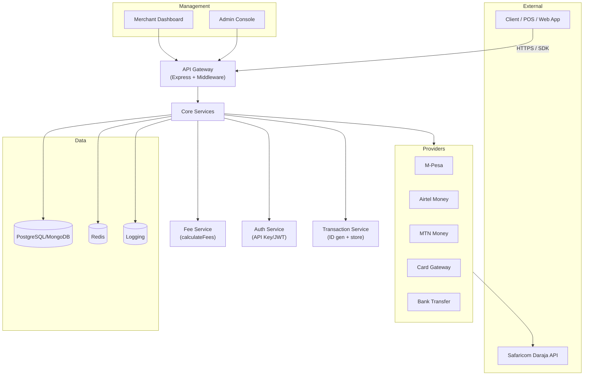

# Pan-African Payment SDK Architecture

This document provides a detailed explanation of the SDK's architecture, components, and workflows.

## System Overview

The Pan-African Payment SDK is designed as a modular, extensible system that facilitates mobile-money payments for Kenyan SMEs, with support for multiple payment methods and premium services.

The architecture is organized into the following core components:

1. **Core Services** - The fundamental building blocks of the system
2. **Payment Methods** - Integrations with various payment providers
3. **Integrations** - SDK packages for different platforms
4. **Premium Services** - Value-added features available as add-ons
5. **Management** - Administrative tools and user interfaces

## Architecture Diagram

